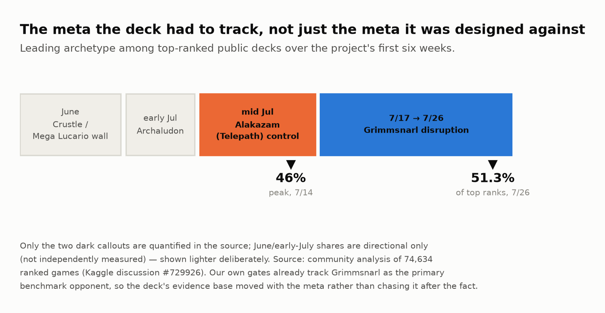
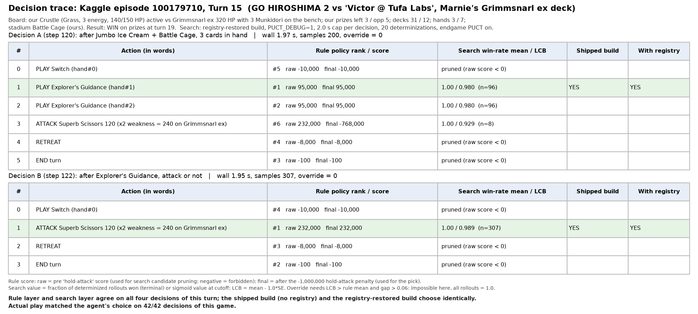
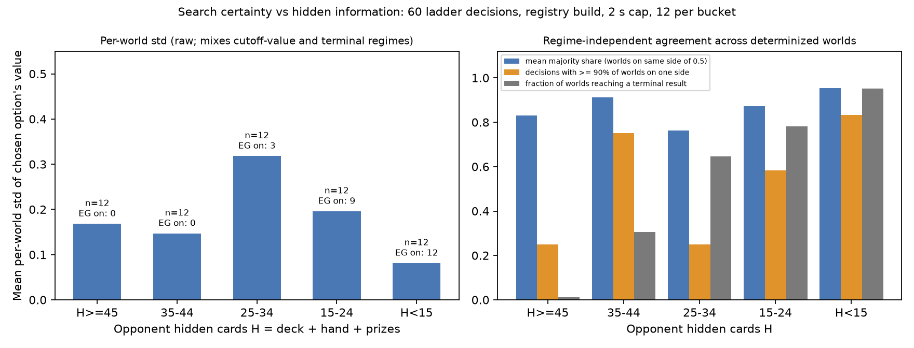

# Great Tusk: Shrink the Hidden Information

**Subtitle:** A deck built to drag every match into the near-perfect-information endgame, a four-layer agent that matches its tool to decision certainty, and 4,852 ladder games read honestly.

---

## TL;DR

*Strategy:* pull every game toward deck-out so the hidden state shrinks — exact arithmetic and search both work better there — and let search finish what heuristics cannot. *Deck:* Great Tusk mill behind a Crustle wall, Neutralization Zone turning off ex attackers. *Method:* four decision layers matched to decision certainty, every change gated by sequential testing and human replay review. *Result:* 799.3, rank 1,150 of 6,807 (top 17%). *What the ladder taught us:* hidden cards fall from 59 to 18 by the time the regime is reached; games that reach it are won 71%, the rest 25%; builds whose search fired converted the regime 7 points better than the final build, which shipped without it; the gap to the top is the opening.

## 1. Why this strategy: make imperfect information act like perfect information

In chess, shogi and Go, search is superhuman; Pokémon TCG hides hands, deck order and Prizes, which should blunt it. Our bet: **hidden information decays as both decks empty.** A Prize race can stay uncertain to the end; a deck-out race spends most of its length with both decks face-up in the discard pile. Force that regime and the endgame becomes a *tsumeshogi* — few pieces, a forced line — where search should dominate.

Three hypotheses to test: (H0) reaching the thin-deck regime decides games; (H1) determinized search beats hand-written heuristics; (H2) endgame-only search beats flat rollouts, and leaf quality is not the bottleneck. Section 4 tests them in our league, Section 5 on the ladder.

The meta rotated under us — community analysis of 74,634 ranked games (Sumi, #729926) shows leadership passing from a Crustle/Lucario wall to Archaludon, Alakazam, then Grimmsnarl at 51.3% by late July — so Grimmsnarl became our benchmark (Figure 6).

## 2. The deck: Great Tusk plus a wall that breaks decks

**Concept:** *Great Tusk mills the opponent's deck while a Crustle wall, Neutralization Zone and effect-cancelling energy make their ex attackers hit for nothing — their deck runs out before our Prizes do.* The 60 cards (attached) have four jobs (Figure 5).

**The clock.** Three clocks, recomputed every turn from recent pace: turns until the opponent's deck hits zero (win), until ours does (loss), until their sixth Prize (loss). Every choice is judged by whether it moves the first ahead of the others.

**Mill and wall.** Great Tusk ×4 is a non-Rule-Box Basic: KOing it costs one Prize. Its two-energy Land Collapse discards the top card of the opponent's deck — four if an Ancient Supporter was played that turn, which is why Explorer's Guidance ×4 is a mill multiplier first and draw second. Giant Tusk (160) finishes on the attack plan. Dwebble ×4 into Crustle ×4: Ascension tutors the evolution (self-thinning), Bug Catching Set ×2 thins further, Crustle's Mysterious Rock Inn zeroes ex attacks and Superb Scissors (120) ignores effects on their Active.

**Two openings, chosen on turn 1** from the opponent's first visible cards. *Mill plan* (default): Dwebble line to two, energy on Great Tusk until mill-ready, Land Collapse from the first attacking turn, and — going second — Budew forward on turn 2 for a free Item lock. *Attack plan*, on sight of Marnie's Grimmsnarl (its line, Munkidori, Froslass) or Abomasnow/Kyogre: Grimmsnarl is Grass-weak, so Crustle goes forward and Superb Scissors hits for 240; Kyogre's Riptide returns energy to the deck, so deck-out cannot be won. On that plan Boss's Orders has two uses — a KO this turn, or removing a Basic before it grows — and the agent takes whichever Prize it can secure now. Against Alakazam the opening is defensive: a second Great Tusk benched, special energy attached just-in-time because Alakazam lists carry Enhanced Hammer. The plan can flip mid-game (two turns behind the race against a deck that does not dig itself), with hysteresis: once attacking, it returns to milling only if the race turns clearly winnable, if Crustle is one-shot, or against a passive non-ex tank.

**Take away their turn, not their HP.** Crushing Hammer ×2, Xerosic's Machinations ×2, one Budew, Jumbo Ice Cream ×2 (heal 80, added against Munkidori's counter transfers to buy Crustle a turn). None deals damage; all slow the opponent's clock. Two Hammers, not four: every Item played is a card not milling.

**Make their ex swing for nothing.** Neutralization Zone (ACE SPEC) stops all damage from ex/V attacks to non-Rule-Box Pokémon — everything we play qualifies. Rock Fighting ×4 and Mist ×2 cancel attack effects, added for Alakazam, whose line resists Fighting and wins through effects Mist immunity answers; special energy invites Enhanced Hammer, so it is attached just-in-time and Xerosic trims the opponent's hand first. Battle Cage ×2 blocks bench-damage Abilities. Known fragility: a prized Neutralization Zone has no plan B.

**Consistency.** Poké Pad ×4, Lillie's Determination ×4, Boss's Orders ×3, Switch ×3, Counter Gain ×2, Pokégear ×2 — budgeted inside the second clock, since draw digs our own deck.

## 3. The agent: a confidence ladder built on the game's mechanics

One principle: **match the tool to how certain the decision is** (Figure 4).

1. **Deterministic math.** Deck-out countdown and Prize race with exact hypergeometric outs — arithmetic, not search.
2. **Near-perfect-information endgame.** Both decks thin: a PUCT tree search plays the position out.
3. **Uncertain mid-game.** The only place a learned evaluator operates: two profiles (press / grind) chosen by the plan.
4. **Plan choice.** Mill or attack is a discrete rule flag (Section 2); nothing softer helped.

Layers 1 and 4 are a 4,500-line rule policy: three clocks → plan flag → diff of an "ideal board" for the active plan against the real board and hand → ranked want-list → option scores with a hold-attack penalty (the numbers in Figure 7). Recognizing the opponent's archetype flips plan, want-list and evaluator the same turn.

**What shipped.** Layers 1 and 4 played every one of the 4,852 ladder games. Layers 2–3 played the 1,771 pre-deadline games of registry-carrying builds; the final archive shipped without the registry that switches them on (Section 7), so the final entry's 2,000 games are a test of the deck and the deterministic layers alone.

**Handling hidden information.** Search runs over determinized worlds through the competition's Search API: the agent fingerprints the opponent by visible card IDs against roughly three dozen reproduced public decklists, samples hidden cards from that real 60 minus everything seen, force-injects cards revealed in play, and weights the rest by retention rates fit on ~200,000 real positions. Rollouts run the rule policy; a lower-confidence-bound gate rations the budget. No registry match, no machinery: rules alone.

## 4. Which hypotheses we tested, and how

Two habits kept the project honest. Every rule change passes a sequential-probability-ratio test before shipping; a "correct" rule that does not move win rate usually means another path silently overrides it — three such bugs let search override rule judgment until sealed. And we distrust small samples: four times a 64-game swing of ten-plus points vanished by 192 games, so 64-game results only decide what to test next. Human review supplies the other half: a competitive player plays through our viewer, every choice logged with the agent's exact observation, and a diff tool ranks disagreements by frequency — that list produced most fixes.

| Step | Change | Sample | Effect (proxy league; Section 6 on its bias) | Decision |
|---|---|---|---|---|
| Rule sweep, 40 versions | hand-written heuristics only | ~40,000 games | plateau at 48.7% | ceiling reached |
| Search harness ported | determinized search + rule rollouts | 15 proxies | 48.7% → 67.2% | adopt (H1 confirmed) |
| Human-review loop | reviewed fixes, SPRT-gated | n = 1,632 | → 71.2% | adopt |
| Mid-game evaluators ×3 | GBDT / policy clone / value net | matched AUC + A/B | 0 of 3 cleared bar | reject |
| Endgame PUCT | tree search in thin-deck regime | 192-game gate | +7.8 pt vs one archetype, no confirmed loss | adopt (H2 confirmed) |
| Prior ablation | rule prior vs uniform, same tree | same gate | tree structure carries the gain | keep |
| Belief layer | probabilistic hand reading | 192 × 8 opponents | 58.8% → 61.5%; −6.3 pt vs Alakazam | not merged |
| Five final submissions | one reviewed loss fixed per version | live ladder | Grimmsnarl 45% → 52% | ship |

The three failed evaluators converged on one result: leaf quality was not the bottleneck, so effort moved to search structure — the pattern DeepStack and ReBeL report. We also scoped self-play value learning and a distilled rollout policy in July; the 24th-place team shows what that branch needs — a C++ arena at 5,000 games a minute and millions of games per expert — and we did not have it.

## 5. Consistency and matchups: what 4,852 ladder games say

Everything here comes from Kaggle's episode records for our 81 entries (7,006 games; 4,852 across 51 Great Tusk builds), opponents labelled by deck from the leaderboard's visible cards.

**H0: the information really shrinks.** Figure 11 counts, turn by turn across 1,999 final-entry games, how many of the opponent's 60 cards we cannot see (deck + hand + remaining Prizes): 59 on turn 1, 25 by turn 15, 18 when their deck reaches eight — by then what is hidden is hand and Prizes, whose *identity* is a known multiset once the deck is gone. Our own hidden cards fall the same way (56 → 30 by turn 16). Games that never reached the regime ended with 27 hidden; games that reached it, 13.

**H0: reaching the regime decides games.** 63% of games reached it (median turn 16); those were won 70.8%, the rest 25.3%; at five cards, 80% versus 25%. The first number is partly true by construction — a deck-out win passes through it — so the finding is the second: when the deck fails to get there it has almost no other way to win. The strategy is the regime; everything else is how often the deck gets there.

**And search becomes certain there.** Re-running the search layer on 60 real ladder decisions (12 per hidden-card bucket, Figure 12): with fewer than 15 opponent cards hidden, 95% of determinized worlds agreed on the outcome and 83% of decisions were near-unanimous; mid-game (25–34 hidden), 76% and 25%. Small sample; the shape is the mechanism Section 1 bet on.

**H1–H2 on the ladder, with a caveat.** The 1,771 pre-deadline games of registry-carrying builds show the search firing (decisions at the 2 s cap) in 73% of games. Those builds reached the regime as often as the final build (61% vs 63%) but converted it better: 77.8% of reached games won when search fired (n = 833), 67.8% in the same builds when it did not (n = 245), versus 70.8% for the final build (n = 1,261) — a 7-point gap (z ≈ 3.6), the size the league attributed to endgame search. Different builds, pre-deadline pool: consistent with H2, not a controlled test.

**Consistency.** Figure 8 plots daily win rate against opponent-pool composition. Matchmaking pairs similar ratings, so a converged agent should sit near 50%; ours did every day (33–63%; 2,000 post-deadline games at 54.0%) while the pool rotated (Alakazam 6–36%, Grimmsnarl 7–34%).

**Matchups.** Figure 9 splits the games by opponent deck, earlier builds versus final: Mega Lucario 71% → 62% (n = 396 / 286), Archaludon 72% → 59% (259 / 264), Garchomp 63%, Dragapult 56%, Alakazam 53% → 51% (532 / 437). Grimmsnarl — the meta leader and target of the five final submissions — moved 45.3% → 52.2% (530 / 324), the only change beyond its confidence interval; Lucario and Archaludon paid for it.

**Initial states and how games end.** Going first 54.9% (n = 1,271), going second 52.5% (728). 78% of wins came with the opponent's deck at five or fewer (405 outright deck-outs); 48% of losses with our own deck still above 15 — the wall broken before the clock mattered — and 19% with the opponent one to five cards from decking. Games over by turn 8 (5%) were lost 90% of the time: the opening collapse is the deck's main initial-state dependency. No timeouts in 2,000 games.

**Scaling with opponent strength.** Win rate falls monotonically with opponent rating — 65% against sub-700 teams, 49% in our band, 44% against 800–849, 31% against the 900s (n = 572 / 416 / 367 / 29): a rating that measures the agent, not a pool artefact. Figure 10: the final entries top the 51 Great Tusk builds (median 728). Sequential Elo gave fresh entries transient readings above 1,000; we cite converged numbers only and welcome the hosts' planned Bradley-Terry re-fit.

## 6. Performance, what the ladder falsified, and what is open

*Performance.* Final entry 799.3, rank 1,150 of 6,807; both active entries converged within 12 points of each other over 1,000 post-deadline games each.

*Falsified.* Our proxy league had the shipped line at 63.7% against Grimmsnarl and 77.9% against Fighting-ex aggro; the ladder says 52% and 62%. Reproduced public decks driven by our rollout policy are weaker than the live agents behind them, and every shipped change was gated on them.

Unconfirmed: that self-thinning opponents are disproportionately exposed to deck-out (r ≈ 0.15 after isolating their draws from our mill, falling toward zero once game length is controlled). Seven of twelve reviewed live losses traced to tempo in the first two turns — the next iteration's target. Deck and code are ready as-is for a second round.

*Post-deadline experiments (self-run, outside the performance score, reported as the hosts invited):* a 60-game pilot against five proxies had the shipped archive at 66.7% without search and 81.7% with the registry restored and the 10-second cap used until late July. Replicated across all 53 registry opponents, the gap shrank to what our own 64-versus-192 rule predicts: 64.5% without search (n = 636) against 69.6% with 10-second search (n = 212, run three-way parallel), +5.0 points, z ≈ 1.4 — not significant. At the shipped 2-second cap the registry changed nothing (61.7% vs 66.7%, 60 games). The ladder's 7-point regime-conversion gap remains the better-powered estimate of what the missing layers were worth.

## 7. Lessons learned

1. *A deck that makes information plentiful helps every decision layer, and beats search where information is scarce.* H0 held on the ladder with the deterministic layers alone; H2 is consistent; H1 held only in the league.
2. *Gate on the benchmark you will be judged on.* Our league overstated two matchups by ten points.
3. *Negative results, gated hard, are the cheapest map.* Three failed evaluators pointed to the one change that worked.
4. *Test the artefact you ship, at the settings you tested.* The final archive omitted the registry that switches on layers 2–3 — a packaging step our own hygiene check enforced — and the search had run at a 2-second cap since late July. The ladder puts the missing layers at 7 points of regime conversion; our league, at +5 and not significant. An import-time assertion and a smoke run of the exact archive would have caught the first; gating the cap on the ladder, the second.

## Sources

Sumi, "Tracking 3,057 teams through 6 weeks of meta", #729926 · Abhyuday, "Top players' methods, revealed by 30,000 games", #724362 · charmq et al., "24th Place Solution: A Population-Based RL Ecosystem" (Comfey and Brambleghast deck-out lists as parallel work) · Moravčík et al., DeepStack (2017) · Brown et al., ReBeL (2020) · Silver et al., AlphaGo Zero (2017) · cabt engine docs · Kaggle episode records for our 81 submissions (7,006 games) · Code, analysis scripts, per-game labels and full decklist: attached repository.
