# Great Tusk: Shrink the Hidden Information

## TL;DR

*Strategy:* pull every game toward deck-out so the hidden state shrinks — exact arithmetic and search both work better there — and let search finish what heuristics cannot. *Deck:* Great Tusk mill behind a Crustle wall, Neutralization Zone turning off ex attackers. *Result:* 799.3 final, rank 1,150 of 6,807 (top 17%), after peaking at 937.4 early in the run. *What the ladder taught us:* hidden opponent cards fall from 59 to 18 by the time their deck is down to eight; games that get there are won 71%, the rest 25%; earlier builds whose search visibly fired converted that regime about 7 points better than the final build, which shipped without search (different builds, not a controlled test). *Post-deadline:* in a predeclared test of 300 thin-deck positions, revealing the sampled hidden configuration gained only +0.8 points, and an exploratory follow-up found about one-fifth the forecast error of early-game positions.

## 1. Why this strategy: make imperfect information act like perfect information

Pokémon TCG hides hands, deck order and Prizes, which should blunt search. Our bet: **hidden information decays as both decks empty.** A Prize race can stay uncertain to the end; a deck-out race spends most of its length with both decks face-up in the discard pile. Force that regime and we aim to create endgames resembling *tsumeshogi* — few pieces, a forced line — where search should dominate.

Three hypotheses: (H0) reaching the thin-deck regime decides games; (H1) determinized search beats hand-written heuristics; (H2) endgame-only search beats flat rollouts, and leaf quality is not the bottleneck.

**Why deck-out against AI opponents.** Most ladder decks are built to see cards: draw Supporters, Buddy-Buddy Poffin, tutors. An agent that digs for visibility thins its own deck, and every card it draws is one we need not mill. The meta rotated under us (74,634 ranked games, Sumi #729926): Crustle/Lucario, then Archaludon, Alakazam, then Marnie's Grimmsnarl — a deck that barely thins itself, which is why the Crustle attack plan exists and why Grimmsnarl became our benchmark. This is design rationale; the ladder showed only a weak correlation (r ≈ 0.15).

## 2. The deck: Great Tusk plus a wall that breaks decks

**Concept:** *Great Tusk mills the opponent's deck while a Crustle wall, Neutralization Zone and effect-cancelling energy make their ex attackers hit for nothing — their deck runs out before our Prizes do.* Four jobs (Figure 1):

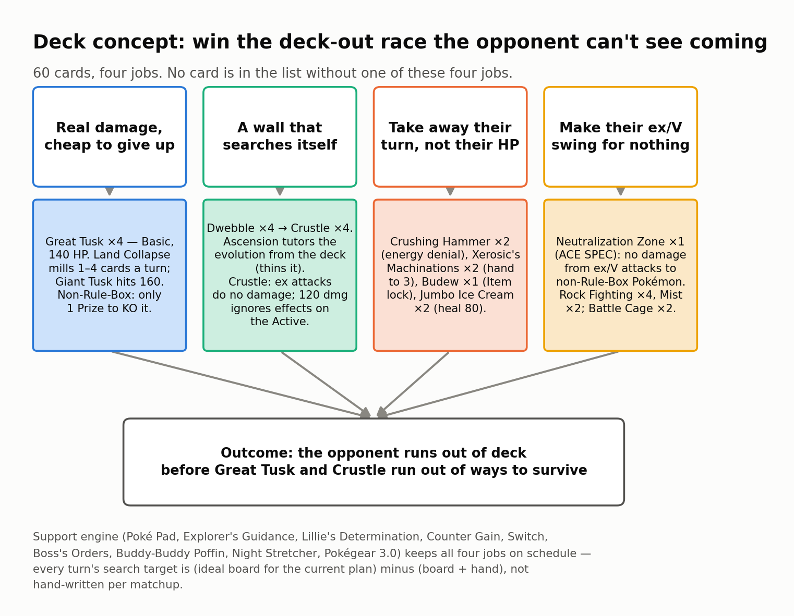

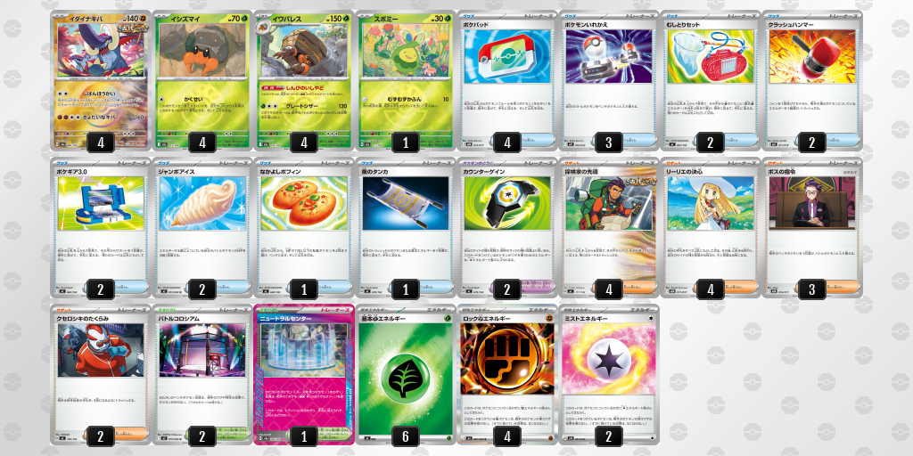

**The clock.** The route controller compares two clocks projected from observed deck-depletion pace — turns until the opponent's deck hits zero and until ours does — to choose mill or attack, with hysteresis. A three-clock race calculator (adding their sixth Prize) runs every turn as a diagnostic; individual actions are chosen by the want-list scoring of Section 3, not by clock movement.

**Mill and wall.** Great Tusk ×4 is a non-Rule-Box Basic: KOing it costs one Prize. Its two-energy Land Collapse discards the top card of the opponent's deck — four if an Ancient Supporter was played that turn, so Explorer's Guidance ×4 is a mill multiplier first and draw second. Dwebble ×4 into Crustle ×4: Ascension tutors the evolution (self-thinning), Crustle's Mysterious Rock Inn blocks damage from ex attacks and Superb Scissors (120) ignores effects on their Active.

**Two openings, chosen on turn 1** from the opponent's first visible cards. *Mill plan* (default): Dwebble line to two, energy on Great Tusk until mill-ready, Land Collapse from the first attacking turn; going second, Budew forward on turn 2 for an Item lock. *Attack plan*, on sight of Marnie's Grimmsnarl (its line, Munkidori, Froslass) or Abomasnow/Kyogre: Grimmsnarl is Grass-weak, so Crustle goes forward and Superb Scissors hits for 240. The plan can flip mid-game (repeated unfavorable race estimates against a deck that does not dig itself), with hysteresis against flip-flopping.

**Take away their turn, not their HP.** Crushing Hammer ×2, Xerosic's Machinations ×2, one Budew, Jumbo Ice Cream ×2.

**Make their ex swing for nothing.** Neutralization Zone (ACE SPEC) stops all damage from ex/V attacks to non-Rule-Box Pokémon — everything we play qualifies. Rock Fighting ×4 protects the Fighting-type Great Tusk it is attached to from attack effects, and Mist ×2 does the same for any Pokémon — both added for Alakazam, whose line resists Fighting and wins through effects; special energy invites Enhanced Hammer, so it is attached just-in-time and Xerosic trims the opponent's hand first. Battle Cage ×2 stops effects that place damage counters on our Bench (not ordinary bench damage).

## 3. The agent: a confidence ladder built on the game's mechanics

One principle: **match the tool to how certain the decision is** (Figure 3).

1. **Rule-based accounting.** Card counts, deck-budget gates and heuristic race estimates set action priorities — arithmetic, not search.
2. **Endgame search.** Once either deck is at most 14 cards, a PUCT tree search runs longer continuations.
3. **Uncertain mid-game.** A route-conditioned learned evaluator (press / grind) scores unfinished continuations here and at the endgame cutoff.
4. **Plan choice.** Mill or attack is a discrete rule flag (Section 2); nothing softer helped.

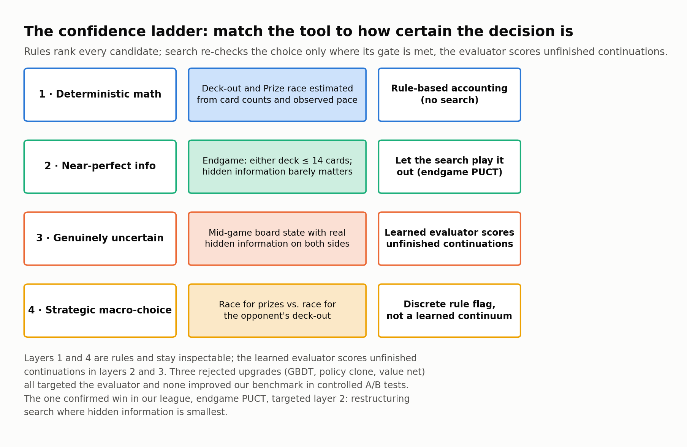

Layers 1 and 4 are a 4,500-line rule policy: deck-depletion pace → plan flag → diff of an "ideal board" against the real board and hand → deck-budget gates → ranked want-list → option scores with a hold-attack penalty (Figure 4).

**What shipped.** Layers 1 and 4 played all 4,852 ladder games; layers 2–3 were available only in the 1,771 pre-deadline games of registry-carrying builds. The final archive shipped without the registry that switches them on, so the final entry's 2,000 games test the deck and the rule layers alone.

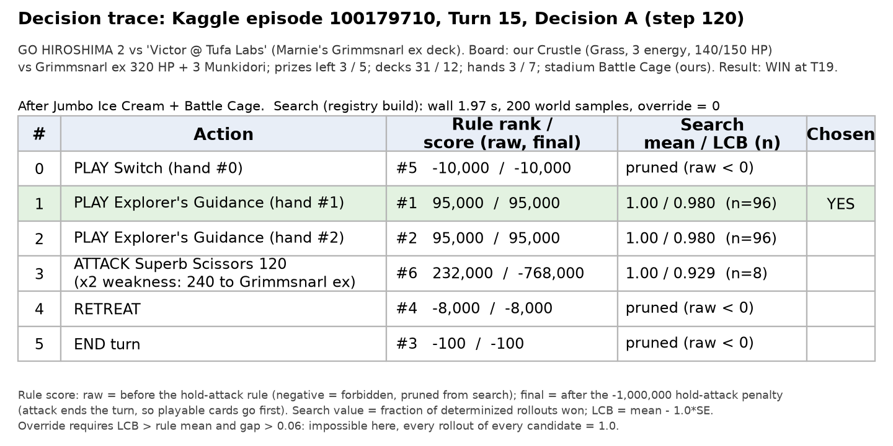

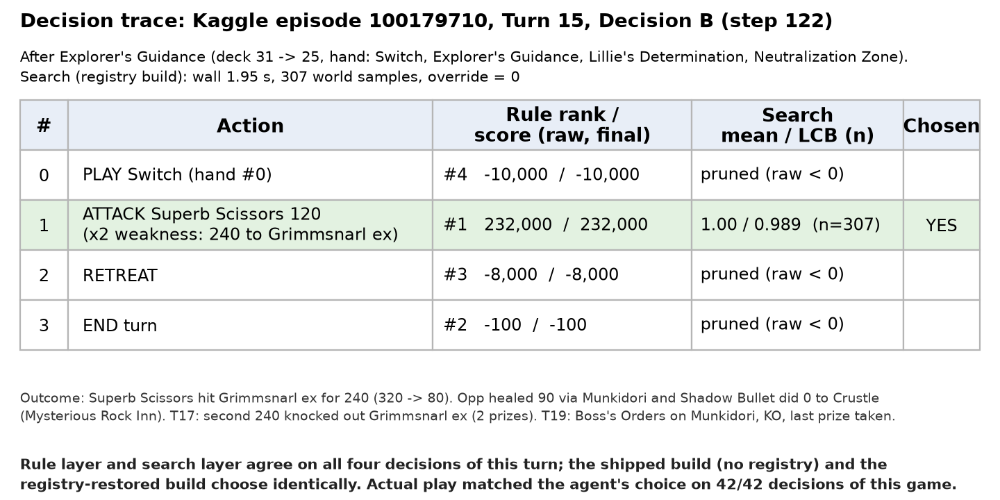

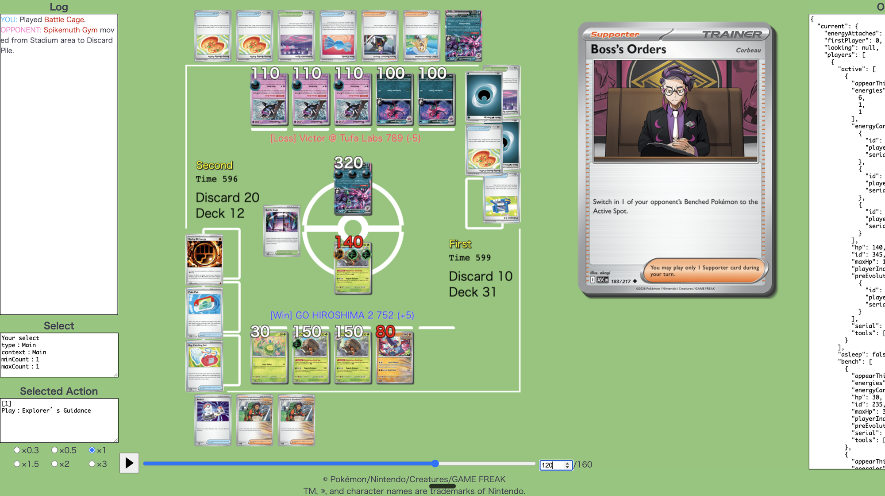

**Handling hidden information.** Search runs over determinized worlds through the competition's Search API: the agent fingerprints the opponent by visible card IDs against roughly three dozen reproduced public decklists, samples hidden cards from that candidate list minus everything seen. No registry match, no machinery: rules alone.

## 4. Which hypotheses we tested, and how

Candidate changes were evaluated through matchup tests, sequential tests where feasible, ablations and replay review.

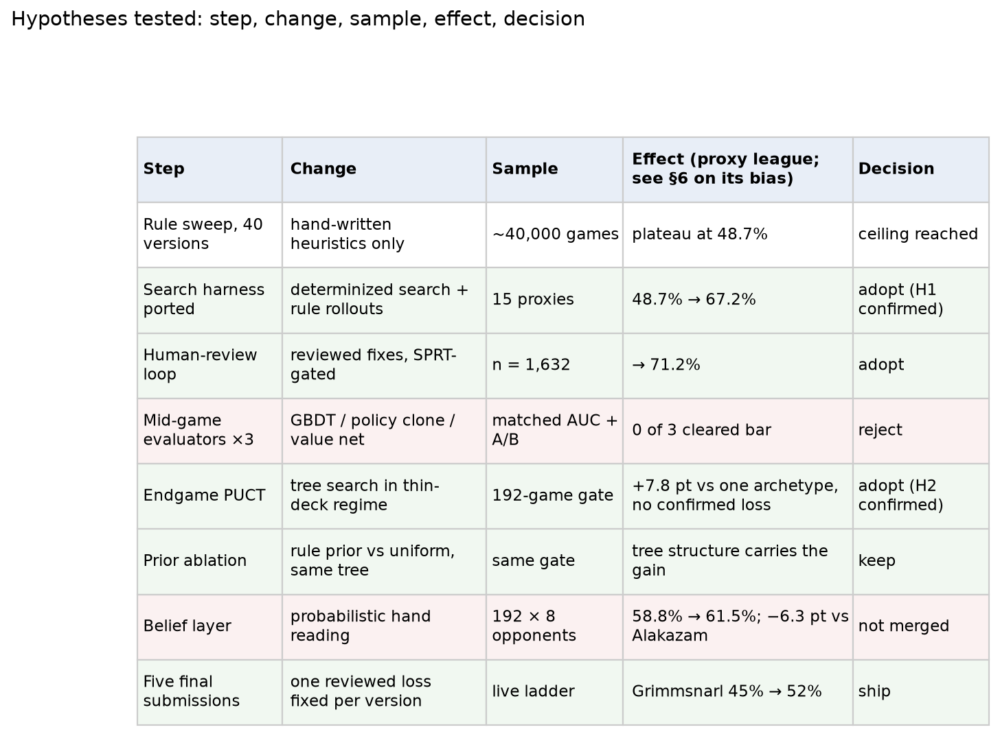

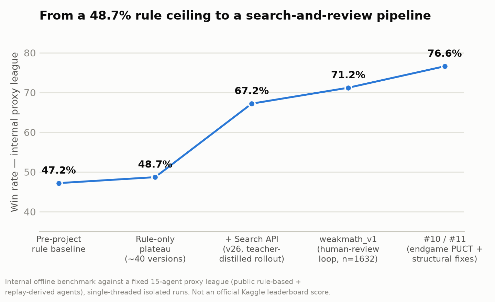

The evaluator variants we tested did not improve our benchmark, which moved effort to search structure.

## 5. Consistency and matchups: what 4,852 ladder games say

All numbers here come from Kaggle's episode records for our 81 entries (7,006 games; 4,852 across 51 Great Tusk builds).

**H0: the information really shrinks.** Three thresholds below are distinct: the *regime* is the opponent's deck at eight or fewer cards; the post-deadline test uses fewer than 15 hidden opponent cards; search switches on when either deck is at most 14. Figure 9 counts, turn by turn across 1,999 final-entry games, how many of the opponent's 60 cards we cannot see (deck + hand + remaining Prizes): 59 on turn 1, 25 by turn 15, 18 when their deck reaches eight — by then, given a known 60-card list, what stays hidden is how the remaining cards split between deck, hand and Prizes, and the order of those eight.

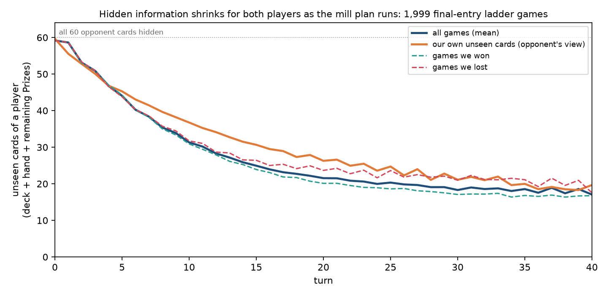

**H0: reaching the regime is strongly associated with winning.** 63% of games reached it (median turn 16); those were won 70.8%, the rest 25.3%. The first number is partly true by construction — a deck-out win passes through it — so the finding is the second: games that never get there are won only a quarter of the time.

**Predeclared post-deadline test.** Before inspecting confirmatory outcomes, we fixed 300 low-hidden-card decisions from distinct final-entry games, and evaluated 16 sampled configurations × 32 continuations per action under fixed policies and supplied decklists: 925,696 terminal continuations. Configuration-conditioned selection gained 0.80 percentage points over the ordinary-information choice (two-sided 95% game-bootstrap CI 0.43–1.22; one-sided upper 1.16, below the predeclared five-point margin). All tested continuations won in 183 positions and lost in 22; 95 varied (Figure 10). These are sampled outcomes under fixed policies, not proofs of forced results or bounds on an optimal solver. Middle and high bands measured 2.17 and 1.14 points, the high band failing the 80% reference-stability screen, so we claim no monotone decay.

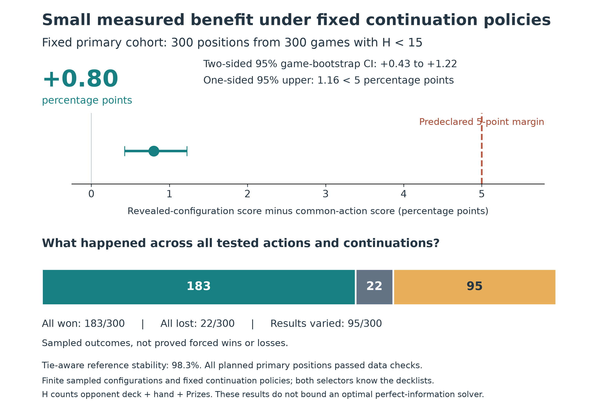

*Exploratory follow-up on the same 900 positions:* forecasting each action's held-out outcome from other sampled configurations had mean squared error 0.122 at 35+ hidden cards, 0.083 at 15–34 and 0.025 below 15; excluding unresolved, all-win and all-loss positions, 0.123, 0.113 and 0.080 (n = 297, 220, 95); 42 same-game pairs agreed on average (difference 0.0475, 95% CI 0.015–0.081; Figure 11). The thin-deck regime is where outcomes become forecastable — an observational association that includes game progress, not card visibility alone.

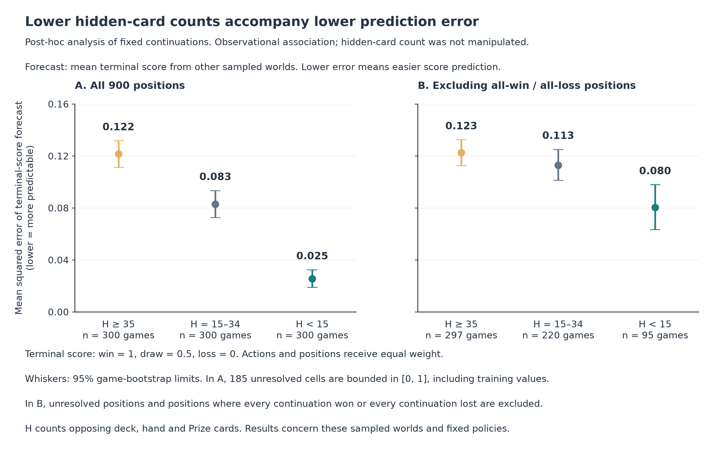

**H1–H2 on the ladder, with a caveat.** We infer that search fired when any decision took more than 1.5 s (the cap was 2 s) (64% of the 1,771 pre-deadline games). Games with visible search converted the regime at 78.1% (n = 757), games in the same builds without it at 69.5% (n = 321), the final build at 70.8% (n = 1,261) — about 7 points. Comparisons across earlier builds are confounded by policy changes and matchmaking; a matched search-on/off effect on the ladder remains unconfirmed.

**Consistency.** Matchmaking pairs similar ratings, so a converged agent should sit near 50%; ours did every day (33–63%, Figure 12) while the pool rotated.

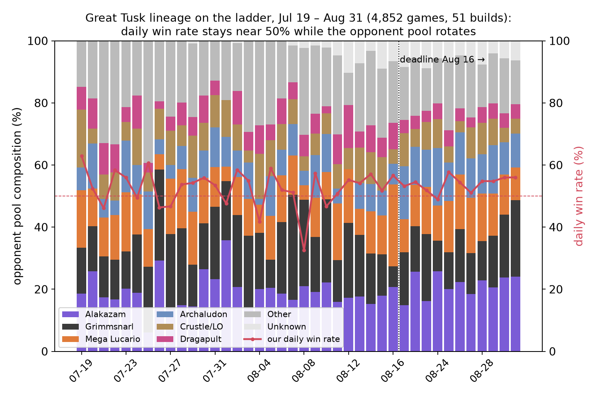

**Matchups.** Figure 13 splits the games by opponent deck, earlier builds versus final: Mega Lucario 71% → 62%, Archaludon 72% → 59%, Alakazam 53% → 51%. Grimmsnarl — the meta leader and target of the five final submissions — moved 45.3% → 52.2% (n = 530 / 324), the only change beyond its confidence interval; Lucario and Archaludon paid for it.

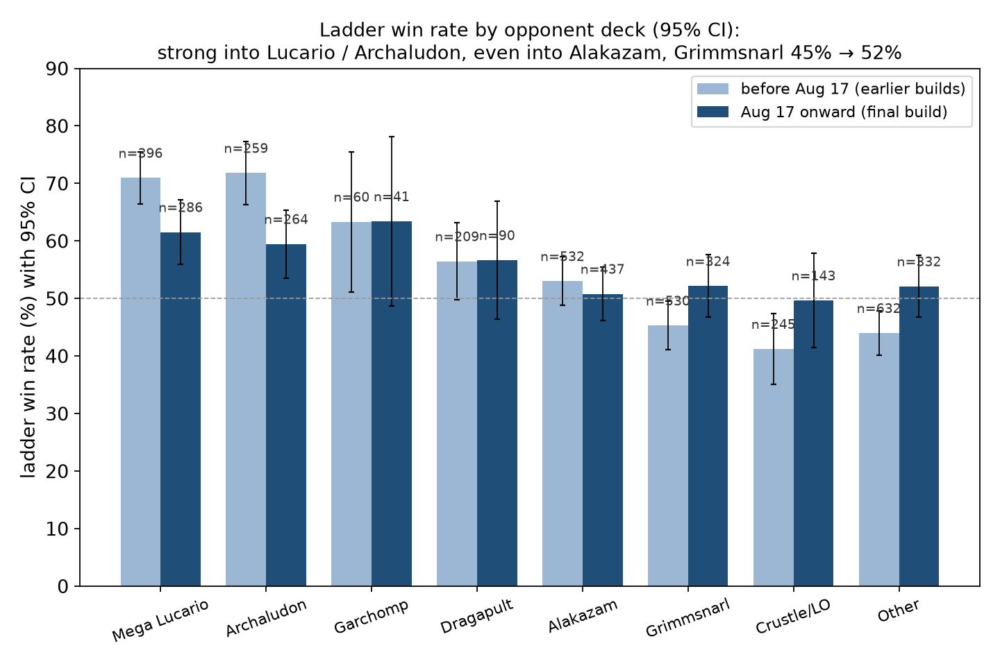

**Initial states and how games end.** Going first 54.9% (n = 1,271), going second 52.5% (728). 78% of wins came with the opponent's deck at five or fewer. Games over by turn 8 (5%) were lost 90% of the time: the opening collapse is the deck's main initial-state dependency. No timeouts in 2,000 games.

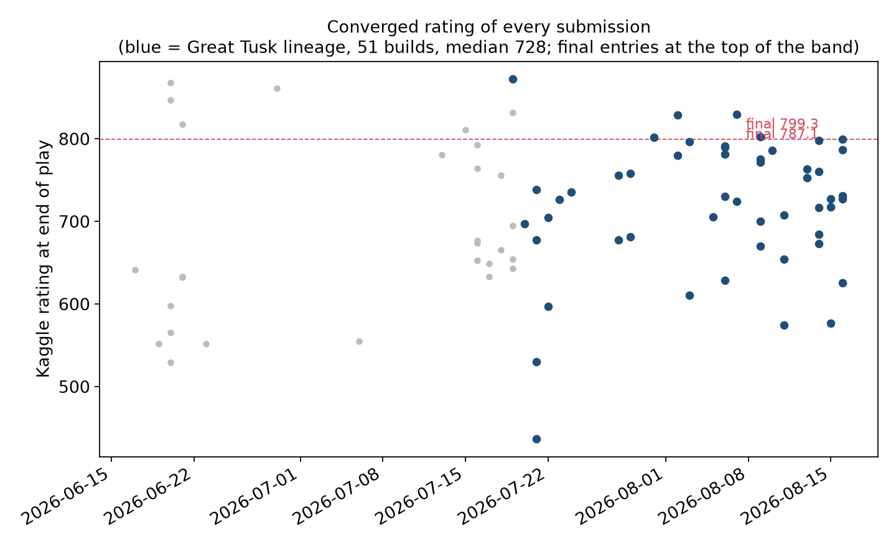

## 6. Performance, what the ladder falsified, and what is open

*Performance.* Final entry 799.3, rank 1,150 of 6,807. It peaked at 937.4 in its first days (leaderboard observation; the API's last 1,000 games show a high of 829.2), and both active entries converged within 12 points (Figure 15). Kaggle ratings start at 600 and climb while an entry is matched against weaker or newer entries, so Section 5 reads win rate against pool composition rather than the rating.

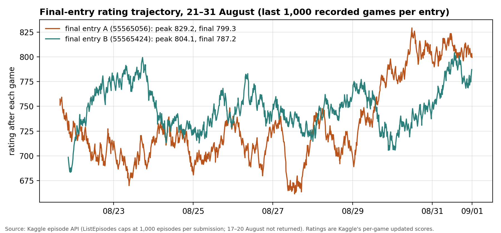

*Falsified.* Our proxy league had the shipped line at 63.7% against Grimmsnarl and 77.9% against Fighting-ex aggro; the ladder says 52% and 62%.

*Post-deadline league check (self-run, outside the performance score):* with the registry restored at a 10-second cap, 69.6% (n = 212) against 64.5% without search (n = 636) across all 53 registry opponents — +5.0 points, z ≈ 1.4, an interval spanning zero. The 10-second comparison does not establish a benefit at the shipped two-second cap.

## 7. Lessons learned

1. *A deck that shrinks hidden information makes the endgame forecastable.* H0 held on the ladder with the rule layers alone, and the low-hidden-card positions showed both the smallest forecast error and the smallest gain from revealed information; H1 held only in the league.
2. *Gate on the benchmark you will be judged on.* Our league overstated two matchups by ten points.
3. *Test the artefact you ship, at the settings you tested.* The final archive omitted the registry that switches on layers 2–3 — and the search had run at a 2-second cap since late July.

## Sources

Sumi #729926 · Abhyuday #724362 · charmq et al. (24th place) · DeepStack (2017) · ReBeL (2020) · AlphaGo Zero (2017) · Long et al. (2010), PIMC · Frank, Basin & Matsubara (1998) · Kaggle episode records · code, decklist, analysis scripts and the frozen post-deadline protocol: https://github.com/forone-ai/ptcg-great-tusk
