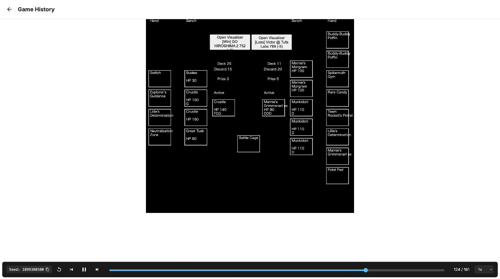

# Great Tusk: Shrink the Hidden Information

## TL;DR

*Strategy:* pull every game toward deck-out so the hidden state shrinks — exact arithmetic and search both work better there — and let search finish what heuristics cannot. *Deck:* Great Tusk mill behind a Crustle wall, Neutralization Zone turning off ex attackers. *Method:* four decision layers matched to decision certainty, every change gated by sequential testing and replay review. *Result:* 799.3, rank 1,150 of 6,807 (top 17%). *What the ladder taught us:* hidden cards fall from 59 to 18 by the time the regime is reached; games that reach it are won 71%, the rest 25%; builds whose search fired converted it 7 points better than the final build, which shipped without search. *Pre-registered, post-deadline:* in 300 thin-deck positions, revealing the hidden cards gained only +0.8 points, and outcomes there were five times easier to forecast than early on.

## 1. Why this strategy: make imperfect information act like perfect information

In chess, shogi and Go, search is superhuman; Pokémon TCG hides hands, deck order and Prizes, which should blunt it. Our bet: **hidden information decays as both decks empty.** A Prize race can stay uncertain to the end; a deck-out race spends most of its length with both decks face-up in the discard pile. Force that regime and the endgame becomes a *tsumeshogi* — few pieces, a forced line — where search should dominate.

Three hypotheses: (H0) reaching the thin-deck regime decides games; (H1) determinized search beats hand-written heuristics; (H2) endgame-only search beats flat rollouts, and leaf quality is not the bottleneck. Section 4 tests them in our league, Section 5 on the ladder.

The meta rotated under us — 74,634 ranked games (Sumi, #729926) show leadership passing from a Crustle/Lucario wall to Archaludon, Alakazam, then Grimmsnarl — so Grimmsnarl became our benchmark.

## 2. The deck: Great Tusk plus a wall that breaks decks

**Concept:** *Great Tusk mills the opponent's deck while a Crustle wall, Neutralization Zone and effect-cancelling energy make their ex attackers hit for nothing — their deck runs out before our Prizes do.* Four jobs (Figure 5):

**The clock.** The route controller compares two clocks projected from recent pace — turns until the opponent's deck hits zero and until ours does — to choose mill or attack, with hysteresis. A three-clock race calculator (adding their sixth Prize) runs every turn as a diagnostic; individual actions are chosen by the want-list scoring of Section 3, not by clock movement.

**Mill and wall.** Great Tusk ×4 is a non-Rule-Box Basic: KOing it costs one Prize. Its two-energy Land Collapse discards the top card of the opponent's deck — four if an Ancient Supporter was played that turn, so Explorer's Guidance ×4 is a mill multiplier first and draw second. Dwebble ×4 into Crustle ×4: Ascension tutors the evolution (self-thinning), Crustle's Mysterious Rock Inn zeroes ex attacks and Superb Scissors (120) ignores effects on their Active.

**Two openings, chosen on turn 1** from the opponent's first visible cards. *Mill plan* (default): Dwebble line to two, energy on Great Tusk until mill-ready, Land Collapse from the first attacking turn, and — going second — Budew forward on turn 2 for a free Item lock. *Attack plan*, on sight of Marnie's Grimmsnarl (its line, Munkidori, Froslass) or Abomasnow/Kyogre: Grimmsnarl is Grass-weak, so Crustle goes forward and Superb Scissors hits for 240; Kyogre's Riptide returns energy to the deck, so deck-out cannot be won. On that plan Boss's Orders either takes a KO now or removes a Basic before it grows. Against Alakazam the opening is defensive: a second Great Tusk benched. The plan can flip mid-game (two turns behind the race against a deck that does not dig itself), with hysteresis: once attacking, it returns to milling only if the race turns clearly winnable, if Crustle is one-shot, or against a passive non-ex tank.

**Take away their turn, not their HP.** Crushing Hammer ×2, Xerosic's Machinations ×2, one Budew, Jumbo Ice Cream ×2 (heal 80, added against Munkidori's counter transfers to buy Crustle a turn).

**Make their ex swing for nothing.** Neutralization Zone (ACE SPEC) stops all damage from ex/V attacks to non-Rule-Box Pokémon — everything we play qualifies. Rock Fighting ×4 protects the Fighting-type Great Tusk it is attached to from attack effects, and Mist ×2 does the same for any Pokémon — both added for Alakazam, whose line resists Fighting and wins through effects; special energy invites Enhanced Hammer, so it is attached just-in-time and Xerosic trims the opponent's hand first. Battle Cage ×2 stops effects that place damage counters on our Bench (not ordinary bench damage). Known fragility: a prized Neutralization Zone has no plan B.

## 3. The agent: a confidence ladder built on the game's mechanics

One principle: **match the tool to how certain the decision is** (Figure 4).

1. **Deterministic math.** Deck-out countdown and Prize race with exact hypergeometric outs — arithmetic, not search.
2. **Near-perfect-information endgame.** Once either deck is at most 14 cards, a PUCT tree search plays the position out.
3. **Uncertain mid-game.** The only place a learned evaluator operates: two profiles (press / grind) chosen by the plan.
4. **Plan choice.** Mill or attack is a discrete rule flag (Section 2); nothing softer helped.

Layers 1 and 4 are a 4,500-line rule policy: deck-depletion pace → plan flag → diff of an "ideal board" against the real board and hand → deck-budget gates (no six-card dig that leaves too little deck for the race) → ranked want-list → option scores with a hold-attack penalty (the numbers in Figure 7a). Recognizing the opponent's archetype flips plan, want-list and evaluator the same turn.

**What shipped.** Layers 1 and 4 played all 4,852 ladder games. Layers 2–3 played the 1,771 pre-deadline games of registry-carrying builds; the final archive shipped without the registry that switches them on (Section 7), so the final entry's 2,000 games test the deck and the deterministic layers alone.

**Handling hidden information.** Search runs over determinized worlds through the competition's Search API: the agent fingerprints the opponent by visible card IDs against roughly three dozen reproduced public decklists, samples hidden cards from that real 60 minus everything seen, force-injects cards revealed in play, and weights the rest by retention rates fit on ~200,000 real positions. No registry match, no machinery: rules alone.

## 4. Which hypotheses we tested, and how

Two habits kept the project honest. Every rule change passes a sequential-probability-ratio test before shipping; a "correct" rule that does not move win rate usually means another path silently overrides it — three such bugs were found that way. We distrust small samples: four times a 64-game swing of ten-plus points vanished by 192 games. A competitive player also plays through our viewer, every choice logged with the agent's observation, and a diff tool ranks disagreements by frequency.

The three failed evaluators converged on one result: leaf quality was not the bottleneck, so effort moved to search structure — the pattern DeepStack and ReBeL report.

## 5. Consistency and matchups: what 4,852 ladder games say

All numbers here come from Kaggle's episode records for our 81 entries (7,006 games; 4,852 across 51 Great Tusk builds), opponents labelled by deck from the leaderboard.

**H0: the information really shrinks.** Figure 11 counts, turn by turn across 1,999 final-entry games, how many of the opponent's 60 cards we cannot see (deck + hand + remaining Prizes): 59 on turn 1, 25 by turn 15, 18 when their deck reaches eight — by then what is hidden is hand and Prizes, whose *identity* is a known multiset once the deck is gone. Games that never reached the regime ended with 27 hidden; games that reached it, 13.

**H0: reaching the regime decides games.** 63% of games reached it (median turn 16); those were won 70.8%, the rest 25.3%; at five cards, 80% versus 25%. The first number is partly true by construction — a deck-out win passes through it — so the finding is the second: when the deck fails to get there it has almost no other way to win. The strategy is the regime; everything else is how often the deck gets there.

**H0 at the decision level (post-deadline, pre-registered).** Protocol frozen before any outcome was seen: 300 final-entry positions with fewer than 15 opponent cards hidden (deck + hand + Prizes), up to 16 sampled hidden configurations each, every legal action played out 32 times under fixed policies — 925,696 continuations. Revealing the true configuration to the chooser gained +0.80 points (95% CI 0.43–1.22, under a predeclared 5-point margin). 183 positions were won under every action and configuration, 22 lost under all, 95 varied (Figure 12): at this depth most positions are already decided, and where they are not, the hidden cards barely change the answer. Mid and high bands gained 2.17 and 1.14 points with unstable references, so we claim no monotone decay; proxy opponents and known decklists are analysis assumptions.

*Exploratory follow-up on the same 900 positions:* forecasting each action's held-out outcome from other sampled configurations had mean squared error 0.122 at 35+ hidden cards, 0.083 at 15–34 and 0.025 below 15; excluding all-win and all-loss positions, 0.123, 0.113 and 0.080 (n = 297, 220, 95); 42 within-game pairs agreed (Figure 13). The thin-deck regime is where outcomes become forecastable — an observational association that includes game progress, not card visibility alone.

**H1–H2 on the ladder, with a caveat.** The 1,771 pre-deadline games of registry-carrying builds show the search firing in 73% of games. Those builds reached the regime as often as the final build (61% vs 63%) but converted it better: 77.8% of reached games won when search fired (n = 833), 67.8% in the same builds when it did not (n = 245), versus 70.8% for the final build (n = 1,261) — a 7-point gap (z ≈ 3.6). Different builds, pre-deadline pool: consistent with H2, not a controlled test.

**Consistency.** Figure 8 plots daily win rate against opponent-pool composition. Matchmaking pairs similar ratings, so a converged agent should sit near 50%; ours did every day (33–63%) while the pool rotated (Alakazam 6–36%, Grimmsnarl 7–34%).

**Matchups.** Figure 9 splits the games by opponent deck, earlier builds versus final: Mega Lucario 71% → 62%, Archaludon 72% → 59%, Alakazam 53% → 51%. Grimmsnarl — the meta leader and target of the five final submissions — moved 45.3% → 52.2% (n = 530 / 324), the only change beyond its confidence interval; Lucario and Archaludon paid for it.

**Initial states and how games end.** Going first 54.9% (n = 1,271), going second 52.5% (728). 78% of wins came with the opponent's deck at five or fewer (405 outright deck-outs); 48% of losses with our own deck still above 15 — the wall broken before the clock mattered. Games over by turn 8 (5%) were lost 90% of the time: the opening collapse is the deck's main initial-state dependency. No timeouts in 2,000 games.

## 6. Performance, what the ladder falsified, and what is open

*Performance.* Final entry 799.3, rank 1,150 of 6,807; both active entries converged within 12 points.

*Falsified.* Our proxy league had the shipped line at 63.7% against Grimmsnarl and 77.9% against Fighting-ex aggro; the ladder says 52% and 62%. Reproduced public decks driven by our rollout policy are weaker than the live agents behind them.

Seven of twelve reviewed live losses traced to tempo in the first two turns — the next iteration's target.

*Post-deadline league check (self-run, outside the performance score):* with the registry restored and the 10-second cap used until late July, 69.6% (n = 212) against 64.5% without search (n = 636) across all 53 registry opponents — +5.0 points, z ≈ 1.4, an interval spanning zero. At the shipped 2-second cap the registry changed nothing. The ladder's 7-point gap remains the better-powered estimate.

## 7. Lessons learned

1. *A deck that makes information plentiful helps every decision layer, and beats search where information is scarce.* H0 held on the ladder with the deterministic layers alone; H2 is consistent; H1 held only in the league.
2. *Gate on the benchmark you will be judged on.* Our league overstated two matchups by ten points.
3. *Negative results, gated hard, are the cheapest map.*
4. *Test the artefact you ship, at the settings you tested.* The final archive omitted the registry that switches on layers 2–3 — and the search had run at a 2-second cap since late July. An import-time assertion and a smoke run of the exact archive would have caught both.

## Sources

Sumi #729926 · Abhyuday #724362 · charmq et al., 24th-place writeup · DeepStack (2017) · ReBeL (2020) · AlphaGo Zero (2017) · Long, Sturtevant, Buro & Furtak (2010), Perfect Information Monte Carlo · Frank, Basin & Matsubara (1998) · Kaggle episode records, 7,006 games · code, scripts, labels, decklist and the frozen information-value protocol (docs/review): https://github.com/forone-ai/ptcg-great-tusk
